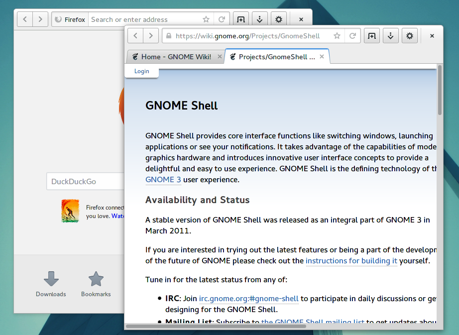

# Adwaita-FF

Metacity window decoration theme for use with Firefox HTitle extension.

## Installation

1. Install [HTitle 2.6b1 or higher](https://addons.mozilla.org/firefox/addon/htitle/versions) and [Stylish](https://addons.mozilla.org/firefox/addon/stylish/), and probably you also want to use [all this stuff](https://addons.mozilla.org/firefox/collections/seleznev/gnome3/) too.

2. Install the theme

  2.1. either using browser
    - Press right click on [this link](https://raw.github.com/uukr/Adwaita-FF/master/metacity-1/metacity-theme-3.xml) and choose "Save link as..." or similar.
    - Save it in directory as follows: <code>~/.local/share/themes/Adwaita-FF/metacity-1/metacity-theme-3.xml</code>

  2.2. <b>or</b> using terminal
    - locate theme directory: <code>cd ~/.local/share/themes/</code>
    - clone the repo <code>git clone https://github.com/uukr/Adwaita-FF.git</code>

3.  Switch theme using [GNOME Tweak Tool](https://wiki.gnome.org/Apps/GnomeTweakTool) <b>or</b> typing in terminal: <code>gsettings set org.gnome.desktop.wm.preferences theme "Adwaita-FF"</code>

4.  Install userstyle from link: [GNOME 3 HTitle tweak](http://userstyles.org/styles/91417)
5.  Done! It should look something like on screenshot below, if not - feel free to create an issue, I will respond ASAP.

